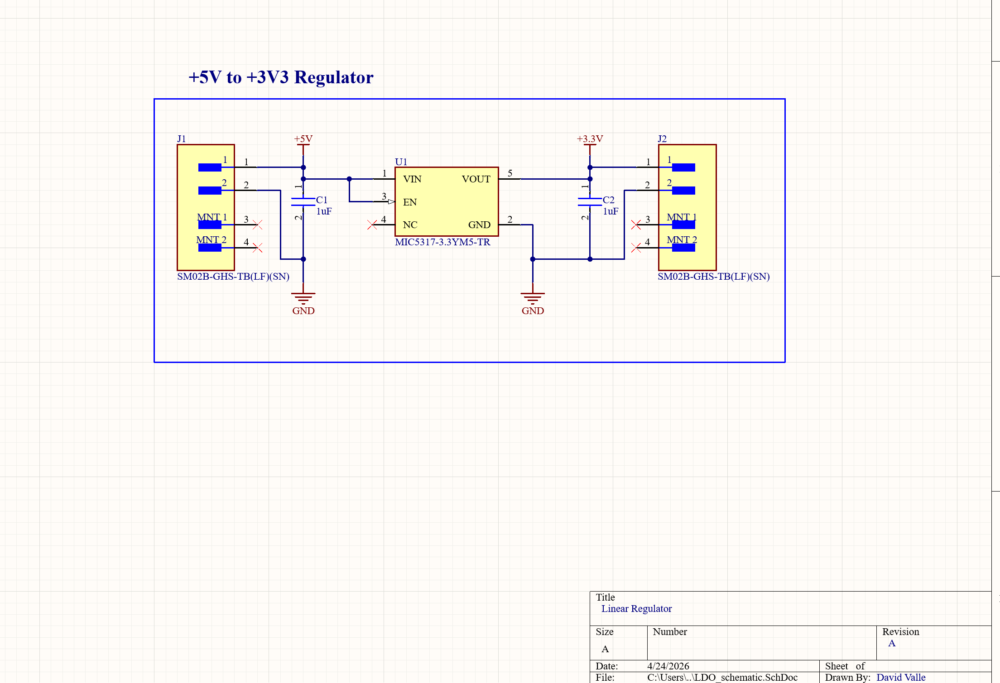
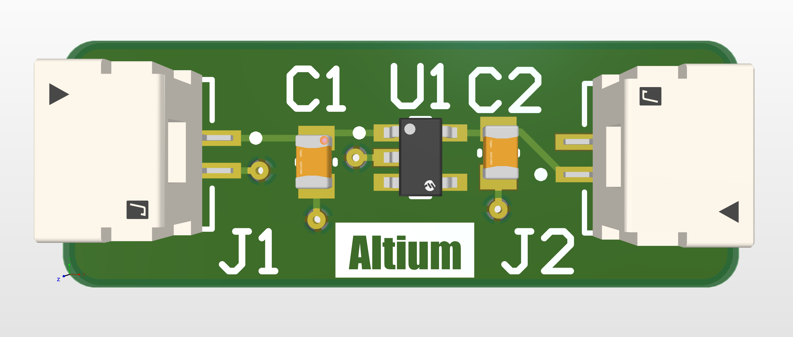

# +5V to +3.3V LDO Voltage Regulator

A compact PCB that converts +5V input to a clean +3.3V output using the MIC5317 LDO regulator. Designed in Altium Designer as a first PCB project.

## About
This board takes a 5V supply and steps it down to 3.3V for powering microcontrollers, sensors, and other 3.3V logic devices. The design is minimal, compact, and uses JST-GH connectors for easy integration into larger systems.

## Preview

## Specifications
| Parameter | Value |
|-----------|-------|
| Input Voltage | +5V |
| Output Voltage | +3.3V |
| Regulator IC | MIC5317-3.3YM5-TR |
| Input Capacitor | 1µF ceramic (C1) |
| Output Capacitor | 1µF ceramic (C2) |
| Connector | JST SM02B-GHS-TB(LF)(SN) |
| PCB Finish | ENIG (recommended) |

## Bill of Materials
| Reference | Component | Value | Package |
|-----------|-----------|-------|---------|
| U1 | MIC5317-3.3YM5-TR | LDO Regulator | SOT-23-5 |
| C1, C2 | Ceramic Capacitor | 1µF | 0402 |
| J1, J2 | JST SM02B-GHS-TB(LF)(SN) | 2-pin connector | SMD |

## Tools Used
- Altium Designer (Schematic & PCB Layout)
- MIC5317 Datasheet

## Fabrication Notes
- All components on top layer
- ENIG surface finish recommended
- Minimum solder mask sliver: 0.1mm
- Minimum silk to solder mask clearance: 0.1mm
- Compatible with JLCPCB / PCBWay standard 2-layer process

## Project Status
🟢 Complete — Ready for fabrication

## License
MIT
